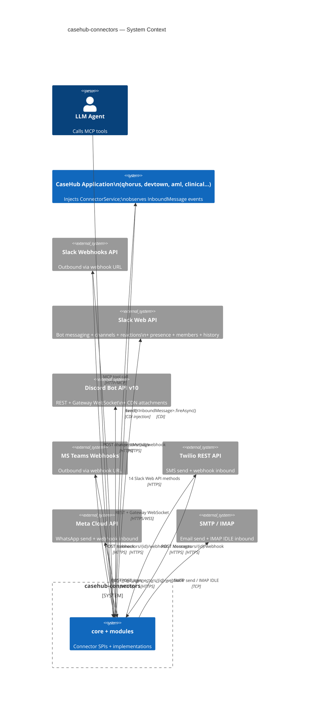
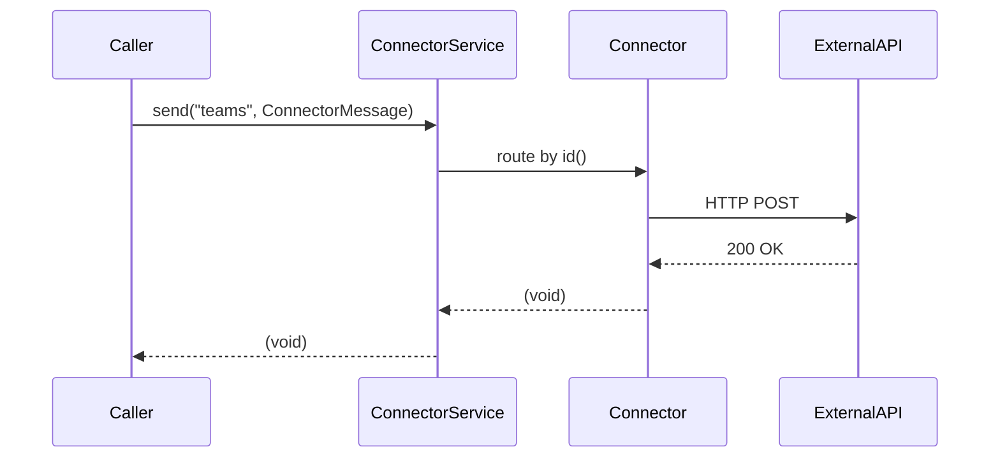
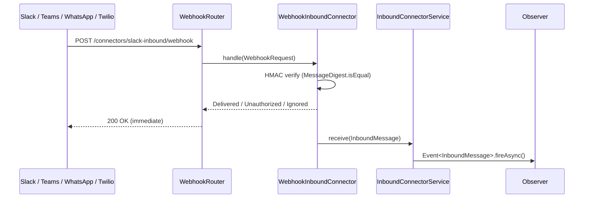
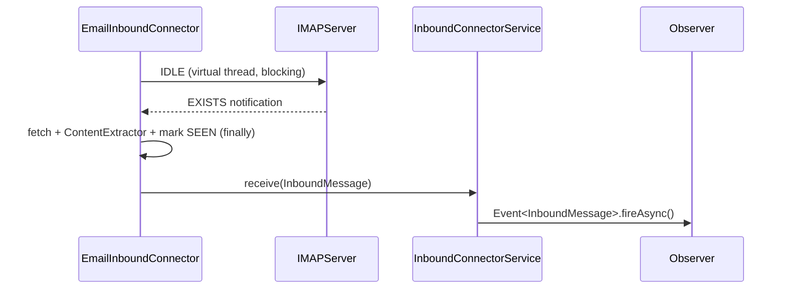
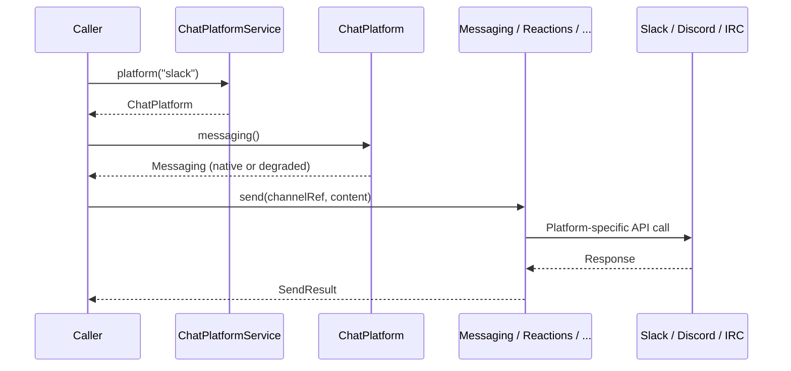
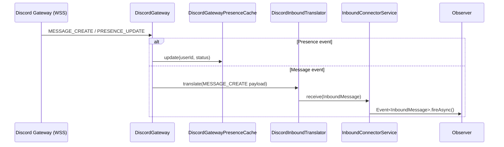
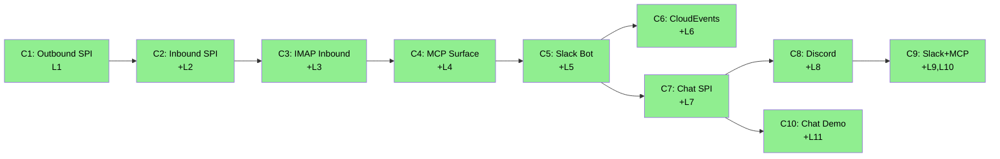

# casehub-connectors — ARC42STORIES.MD

**Spec:** Arc42Stories v0.1
**Profile:** CaseHub — Foundation tier
**Profile ref:** `../parent/docs/arc42stories-casehub-profile.md` · fallback: `https://raw.githubusercontent.com/casehubio/parent/main/docs/arc42stories-casehub-profile.md`
**Build position:** Foundation — no casehubio dependencies
**Consumed by:** casehub-qhorus, casehub-devtown, casehub-aml, casehub-clinical, and any harness deploying the MCP surface
**Depends on:** Quarkus BOM + external standards (core: CDI, cloudevents-core, quarkus-jackson; zero casehubio deps)
**Prefix:** CN

---

## §1 Introduction and Goals

### Purpose

Platform library: outbound and inbound message delivery for the casehubio platform, plus a structured ChatPlatform SPI for rich interaction with chat systems (channels, threads, reactions, presence, members). Callers decide when, what, and to whom; this library handles transport and chat operations.

**Library rule:** no business logic, routing, scheduling, templating, or retry orchestration. This library delivers messages, fires CDI events, and exposes chat capabilities. Everything else is a caller concern.

### Stakeholders

| Stakeholder | Concern |
|---|---|
| Application developer | Inject `ConnectorService`, call `send()` — no knowledge of transport required |
| Chat integrator | Inject `ChatPlatformService`, obtain a `ChatPlatform` — structured channel, thread, reaction, presence interaction |
| LLM agent | Call MCP tools (`send_chat`, `list_chat_channels`, `list_channels`, etc.) |
| `qhorus/connector-backend` | Implement `ConnectorMeshBridge` to observe MCP-initiated deliveries |
| Custom connector implementor | Implement `Connector` as `@ApplicationScoped` CDI bean — auto-discovered |

### Top Quality Goals

| Goal | Mechanism |
|---|---|
| Lightweight foundation | CDI + external standards only (CloudEvents SDK, Jackson); no casehubio dependencies in `core` or `slack-bot` |
| Self-contained connectors | Each connector implements against its own REST API; full delivery path in one class |
| Fail-soft | Connectors log and return on failure — no unchecked exceptions propagate to caller |
| Fail-soft MCP tools | Tools catch all exceptions; return `"Failed: <message>"` — stack traces never reach LLM |
| Delivery-only | No routing, retry orchestration, or business logic inside this library |

### Artifact Schema

| Artifact type | Format | Example | Where it lives |
|---|---|---|---|
| Improvement log entry | `CN-NNN` | `CN-001` | `docs/PROGRESS.md` |
| Issue | `#NNN` or `casehubio/connectors#NNN` | `#18` | GitHub Issues |
| Garden entry | `GE-YYYYMMDD-XXXXXX` | `GE-20260610-9f38b0` | `~/.hortora/garden/` |
| Protocol | `PP-YYYYMMDD-XXXXXX` | `PP-20260610-83747b` | `casehub/garden: docs/protocols/connectors/` |
| ADR | `ADR-NNNN` | `ADR-0001` | `docs/adr/` |
| Blog entry | `YYYY-MM-DD-[initials]NN-title` | `2026-05-29-mdp01-email-arrives` | workspace `blog/` · published `mdproctor.github.io/_notes/` |
| Design spec | `YYYY-MM-DD-topic` | `2026-05-29-inbound-connector-spi-design` | `docs/specs/` |

---

## §2 Constraints

| Constraint | Source |
|---|---|
| Java 21, Quarkus 3.32.2 | Platform standard — all casehubio repos aligned |
| `core` and `slack-bot` modules: no casehubio runtime dependencies; external libraries only (Quarkus CDI, CloudEvents SDK, Jackson) | Design principle — foundation tier embeds without coupling to platform |
| No business logic, routing, or orchestration | Library boundary rule — callers own those concerns |
| CDI-native | Platform convention — no registry, factory, or custom wiring |
| All modules published to GitHub Packages as `0.2-SNAPSHOT` | Platform publishing convention |
| IMAP IDLE only — no polling fallback | ADR-0002 — RFC 2177 supported by all target servers; single code path |

---

## §3 Context and Scope

### System Context

This library sits between casehubio application repos and external messaging platforms. It exposes three surfaces:

1. **CDI SPI** — `Connector`, `ConnectorService`, `InboundConnector`, `WebhookInboundConnector`, `ConnectorDiscovery`, `ConnectorMeshBridge`
2. **ChatPlatform SPI** — `ChatPlatform` with 9 composed capabilities (`Messaging`, `Threading`, `Discovery`, `Reactions`, `Presence`, `Members`, `ChannelManagement`, `MemberManagement`, `MessageHistory`)
3. **MCP tools** — 8 tools callable by LLM agents
4. **CDI async event bus** — `InboundMessage` fired on `Event<InboundMessage>.fireAsync()`

### External Interfaces

| System | Direction | Protocol | Auth |
|---|---|---|---|
| Slack Webhooks API | Outbound | HTTPS POST | Webhook URL (no config — passed as `destination`) |
| Slack Web API | Outbound + ChatPlatform | HTTPS | Bot token (`xoxb-…`) via MP Config; 14 API methods |
| Discord Bot API v10 | Outbound + ChatPlatform + Inbound | HTTPS + WSS | Bot token via MP Config; REST for messaging/channels/members, Gateway WebSocket for presence/inbound |
| Discord CDN | Inbound (attachments) | HTTPS GET | No auth; SSRF-defended hostname allowlist (`cdn.discordapp.com`, `media.discordapp.net`) |
| MS Teams | Outbound | HTTPS POST | Webhook URL (no config — passed as `destination`) |
| Twilio SMS | Outbound + Inbound | HTTPS | Account SID + Auth Token via MP Config |
| Meta WhatsApp Cloud | Outbound + Inbound | HTTPS | API token + phone-number-id via MP Config |
| SMTP | Outbound | TCP (587) | Username + Password via `quarkus-mailer` config |
| IMAP | Inbound | TCP (993, TLS) | Username + Password via MP Config or `EmailInboundAccountProvider` |

---

## §4 Solution Strategy

### Core Patterns

| Decision | Rationale |
|---|---|
| CDI-native discovery | `@ApplicationScoped` beans collected via `@All List<Connector>` — no registry, no factory, no custom wiring |
| Direct REST implementations | Each connector targets its own REST API; full delivery path visible in one class |
| Separate inbound types | `InboundConnector` (pull lifecycle) and `WebhookInboundConnector` (no lifecycle) — type system encodes the contract; ADR-0001 |
| Async CDI event bus | `Event<InboundMessage>.fireAsync()` — connectors deliver and return immediately; Slack's 3-second retry deadline met regardless of observer duration |
| MCP surface isolation | `mcp` module is opt-in; `quarkus-mcp-server-core` not required in CDI-only deployments |
| `ConnectorMeshBridge` in `core` not `mcp` | `qhorus/connector-backend` depends on `core` already; SPI placement avoids a new cross-repo dep; ADR-0003 |
| Composed capabilities | `ChatPlatform` assembles 9 capability interfaces via Builder; each returns a capability or a graceful degradation default; platforms declare what they support natively |
| Graceful degradation | Every capability has a no-op/empty default (`NoOpReactions`, `EmptyDiscovery`, etc.); callers never null-check — they call the method and get correct behaviour even when unsupported |
| RichCard content model | Platform-agnostic rich content (`RichCard`: title, description, color, fields, footer, image, thumbnail) translated to Block Kit (Slack) or Discord Embed per platform |

### Layer Taxonomy

| Layer | What it represents |
|---|---|
| L1 — Outbound SPI | `Connector`, `ConnectorService`, `ConnectorMessage`, 5 built-in outbound connectors, `ConnectorMeshBridge` SPI |
| L2 — Inbound SPI | `InboundConnector`, `WebhookInboundConnector`, `InboundMessage`, `WebhookRouter`, 4 webhook connectors, async event bus |
| L3 — IMAP Inbound | `EmailInboundConnector`, `EmailInboundAccountProvider`, `Attachment`, IMAP IDLE, exponential backoff |
| L4 — MCP Surface | `McpContentSanitizer`, 5 outbound MCP tools, `ConnectorMeshBridge` bridge call |
| L5 — Slack Bot | `SlackBotClient` (16 methods / 14 Slack API endpoints), `ConnectorDiscovery`, `SlackBotDiscovery`, `ChannelDiscoveryMcpTool`, cursor pagination |
| L6 — CloudEvents Adapter | `ConnectorsCloudEventAdapter`, `InboundConnectorTypes` — in core; observes `InboundMessage`, fires `CloudEvent` |
| L7 — Chat Platform SPI | `ChatPlatform`, 9 capability interfaces (`Messaging`, `Threading`, `Discovery`, `Reactions`, `Presence`, `Members`, `ChannelManagement`, `MemberManagement`, `MessageHistory`), model types (`Channel`, `RichCard`, `SendResult`, etc.), degradation defaults, `ChatPlatformService`, `ChatInboundAdapter`; `chat-ref` (all native) and `chat-irc` (3 native) |
| L8 — Discord | `discord` module (HTTP client — 19 methods, Gateway WebSocket, CDN download with SSRF defense), `chat-discord` (ChatPlatform with 8 native capabilities, `DiscordInboundConnector` via Gateway) |
| L9 — Chat Slack | `chat-slack` (`SlackChatPlatform` with 9 native capabilities — most capable implementation; batch user fetch for members, full ts-precision message history) |
| L10 — MCP Chat Surface | `send_chat` (unified ChatPlatform send with RichCard + threading), `list_chat_channels` (rich channel listing with member count) — extends L4 |
| L11 — Chat Demo | `chat-demo` module (profile-gated `-Pdemo`): `SqliteChatBackend`, REST endpoints, WebSocket broadcaster, seed DB, Quinoa UI (`-Pui`) with JWT identity, responsive layout, qhorus Lit components. Not published. |

### Chapter Sequencing Rationale

- C1 before C2: `ConnectorService`, `ConnectorMessage`, and `InboundMessage` introduced in C1 are the data model and routing layer C2 builds on
- C2 before C3: `InboundConnectorService` and `InboundMessageSink` (C2) are the delivery mechanism `EmailInboundConnector` calls
- C3 before C4: MCP tools in C4 call `ConnectorService` for all 5 outbound transports; full test coverage requires all transports present
- C4 before C5: `SlackBotMcpTool` extends the MCP surface and uses the `ConnectorMeshBridge` bridge call pattern established in C4

---

## §5 Building Block View

### Module Structure

| Module | Artifact | Depends on |
|---|---|---|
| `core` | `casehub-connectors-core` | CDI, `cloudevents-core`, `quarkus-jackson` |
| `webhook` | `casehub-connectors-webhook` | `core`, `quarkus-rest` |
| `email` | `casehub-connectors-email` | `core`, `quarkus-mailer` |
| `email-inbound` | `casehub-connectors-email-inbound` | `core`, `angus-mail` |
| `slack-bot` | `casehub-connectors-slack-bot` | `core` |
| `discord` | `casehub-connectors-discord` | `core`, `quarkus-arc`, `vertx-core` |
| `mcp` | `casehub-connectors-mcp` | `core`, `email`, `slack-bot`, `chat-spi`, `quarkus-mcp-server-core` |
| `chat-spi` | `casehub-connectors-chat-spi` | `core`, `simulation-api`, `quarkus-arc` |
| `chat-ref` | `casehub-connectors-chat-ref` | `chat-spi`, `quarkus-arc` |
| `chat-irc` | `casehub-connectors-chat-irc` | `chat-spi`, `core` |
| `chat-discord` | `casehub-connectors-chat-discord` | `chat-spi`, `core`, `discord` |
| `chat-slack` | `casehub-connectors-chat-slack` | `chat-spi`, `core`, `slack-bot` |
| `chat-demo` | `casehub-connectors-chat-demo` | `chat-spi`, `chat-ref`, `core`, `casehub-pages-auth`, `quarkus-rest-jackson`, `quarkus-websockets-next`, `sqlite-jdbc`, `HikariCP` (profile-gated `-Pdemo`) |
| `calendar-spi` | `casehub-connectors-calendar-spi` | `simulation-api`, `jackson-annotations`, `quarkus-arc` |
| `calendar-ref` | `casehub-connectors-calendar-ref` | `calendar-spi`, `quarkus-arc` |
| `calendar-google` | `casehub-connectors-calendar-google` | `calendar-spi`, `google-api-services-calendar` |
| `bank-spi` | `casehub-connectors-bank-spi` | `connectors-api`, `simulation-api`, `quarkus-arc` |
| `bank-truelayer` | `casehub-connectors-bank-truelayer` | `bank-spi`, `connectors-api`, `quarkus-oidc-client`, `quarkus-rest` |
| `email-spi` | `casehub-connectors-email-spi` | `connectors-api`, `simulation-api`, `quarkus-arc` |

`email` and `email-inbound` are separate because `quarkus-mailer` (SMTP) and `angus-mail` (IMAP) share no infrastructure. `webhook` is separate because `quarkus-rest` is unnecessary for outbound-only deployments. `mcp` is separate because `quarkus-mcp-server-core` is not in the Quarkus BOM. `discord` (HTTP client + Gateway) is separate from `chat-discord` (ChatPlatform) because the client can be consumed independently. `chat-slack` depends on `slack-bot` (existing HTTP client) rather than duplicating Slack API calls.

```mermaid
C4Container
  title casehub-connectors — Layer Architecture
  Container_Boundary(b1, "Layer L1 — Outbound SPI") {
    Container(connector_spi, "Connector SPI", "Java interface", "id() + send(ConnectorMessage)")
    Container(connector_service, "ConnectorService", "Java, CDI", "Routes by connector id; @All List<Connector>")
    Container(core_impls, "SlackConnector · TeamsConnector\nTwilioSmsConnector · WhatsAppConnector", "Java, HttpClient", "Direct REST implementations")
    Container(email_conn, "EmailConnector", "Java, quarkus-mailer", "SMTP outbound")
    Container(mesh_bridge, "ConnectorMeshBridge SPI\n+ NoOpConnectorMeshBridge", "Java interface + CDI", "MCP-surface observability hook")
  }
  Container_Boundary(b2, "Layer L2 — Inbound SPI") {
    Container(inbound_spi, "InboundConnector SPI", "Java interface", "Pull: start(sink) + stop()")
    Container(webhook_spi, "WebhookInboundConnector", "Java abstract class", "Passive: handle(WebhookRequest)")
    Container(webhook_impls, "SlackInboundConnector · TeamsInboundConnector\nWhatsAppInboundConnector · TwilioSmsInboundConnector", "Java, SigHelper", "HMAC verification per platform")
    Container(webhook_router, "WebhookRouter", "JAX-RS", "GET|POST /connectors/{id}/webhook")
    Container(inbound_service, "InboundConnectorService", "CDI", "Event<InboundMessage>.fireAsync()")
  }
  Container_Boundary(b3, "Layer L3 — IMAP Inbound") {
    Container(email_inbound, "EmailInboundConnector", "Java, IMAP IDLE", "Virtual thread per account; exponential backoff")
    Container(account_provider, "EmailInboundAccountProvider SPI\n+ DefaultEmailInboundAccountProvider", "Java interface + CDI", "Account config; @DefaultBean reads MP Config")
  }
  Container_Boundary(b4, "Layer L4 — MCP Surface") {
    Container(mcp_tools, "SlackMcpTool · TeamsMcpTool\nTwilioSmsMcpTool · WhatsAppMcpTool · EmailMcpTool", "Quarkus MCP, @Blocking", "5 outbound tools; fail-soft; bridge on success")
    Container(sanitizer, "McpContentSanitizer", "Java", "Truncates + strips control chars before bridge")
  }
  Container_Boundary(b5, "Layer L5 — Slack Bot") {
    Container(slack_bot_client, "SlackBotClient", "Java, HttpClient", "16 methods / 14 Slack API endpoints")
    Container(discovery_spi, "ConnectorDiscovery SPI", "Java interface", "discover() → List<DiscoveredTarget>")
    Container(slack_discovery, "SlackBotDiscovery", "CDI", "ConnectorDiscovery via SlackBotClient")
  }
  Container_Boundary(b7, "Layer L7 — Chat Platform SPI") {
    Container(chat_spi, "ChatPlatform SPI", "Java interfaces", "9 capabilities + Builder\n+ graceful degradation defaults")
    Container(chat_model, "Model", "Java records", "Channel · RichCard · SendResult\nMember · PresenceStatus")
    Container(chat_service, "ChatPlatformService", "CDI", "Platform lookup by id")
  }
  Container_Boundary(b8, "Layer L8 — Discord") {
    Container(discord_client, "DiscordClient", "Java, HttpClient", "19 REST methods (v10)")
    Container(discord_gw, "DiscordGateway", "Vert.x WebSocket", "Presence + inbound events")
    Container(chat_discord, "DiscordChatPlatform", "CDI", "8 native capabilities")
  }
  Container_Boundary(b9, "Layer L9 — Chat Slack") {
    Container(chat_slack, "SlackChatPlatform", "CDI", "9 native capabilities\n(most capable impl)")
  }
  Container_Boundary(b10, "Layer L10 — MCP Chat Surface") {
    Container(chat_mcp, "ChatPlatformMcpTool", "Quarkus MCP, @Blocking", "send_chat · list_chat_channels")
    Container(disc_mcp, "ChannelDiscoveryMcpTool", "Quarkus MCP, @Blocking", "list_channels")
  }
  Container_Boundary(b12, "Layer L12 — Bank Platform SPI") {
    Container(bank_spi, "BankPlatform SPI", "Java interface, @SimulationEligible\ncapabilities={accountInformation, paymentInitiation}", "id() + accountInformation(userId)\npaymentInitiation(userId) + supports()")
    Container(bank_acct, "AccountInformation", "Capability interface", "listAccounts() + balance()\nlistTransactions() + getTransaction()")
    Container(bank_pay, "PaymentInitiation", "Capability interface", "initiatePayment() + paymentStatus()")
    Container(bank_model, "Model", "Java records", "AccountInfo · AccountBalance · Transaction\nPaymentRequest · InitiatedPayment\nPaymentDestination (sealed)")
    Container(bank_service, "BankPlatformService", "CDI", "Platform lookup by id")
  }
  Container_Boundary(b14, "Layer L14 — TrueLayer Bank Provider") {
    Container(tl_platform, "TrueLayerBankPlatform", "CDI, BankPlatform", "AISP + PISP via TrueLayer API")
    Container(tl_client, "TrueLayerClient", "HttpHelper.CLIENT", "Data API + Payments API\njakarta.json parsing")
    Container(tl_consent, "TrueLayerConsentService", "CDI", "PSD2 consent lifecycle\nstate-based CSRF · token refresh")
    Container(tl_callback, "TrueLayerAuthCallback", "JAX-RS", "GET /auth/truelayer/callback\n302 redirect after consent")
  }
  Container_Boundary(b13, "Layer L13 — Email Platform SPI") {
    Container(email_spi, "EmailPlatform SPI", "Java interface, @SimulationEligible", "id() + listMailboxes()\nlistMessages() + getMessage()\ngetAttachmentContent()")
    Container(email_model, "Model", "Java records", "Mailbox · EmailSummary\nEmailMessage · EmailAttachment")
    Container(email_service, "EmailPlatformService", "CDI", "Platform lookup by id")
  }
```

---

## §6 Runtime View

### Outbound Message Delivery

### Inbound Webhook Delivery

### IMAP IDLE Delivery

### ChatPlatform Capability Call

### Discord Gateway Inbound

---

## §7 Deployment View

This is a Java library — no standalone deployment. Consuming applications add Maven dependencies.

| Module | Include when |
|---|---|
| `core` | Always — outbound CDI SPI |
| `webhook` | Inbound via webhooks (Slack, Teams, WhatsApp, Twilio SMS) |
| `email` | Outbound SMTP email |
| `email-inbound` | Inbound IMAP email |
| `slack-bot` | Slack bot messaging + channel discovery |
| `mcp` | MCP tool surface for LLM agents |
| `chat-spi` | ChatPlatform SPI — capability interfaces and model types |
| `chat-ref` | In-memory ChatPlatform — SPI contract testing |
| `chat-irc` | IRC ChatPlatform — bridging to IRC servers |
| `discord` | Discord Bot REST + Gateway client |
| `chat-discord` | Discord ChatPlatform implementation |
| `chat-slack` | Slack ChatPlatform implementation |
| `chat-demo` | Demo chat app (profile-gated `-Pdemo`, not published) |

Consuming app adds `quarkus-mcp-server-http` (not in this library) for MCP transport.

Published to GitHub Packages: `io.casehub:casehub-connectors-*:0.2-SNAPSHOT`

CI resolves via `server-id: github` + `GITHUB_TOKEN`.

---

## §8 Crosscutting Concepts

### Protocol References

| Concern | Protocol | Governs |
|---|---|---|
| Shared HTTP client | `PP-20260607-9794cb` | `HttpHelper.CLIENT` singleton — all modules share one `java.net.http.HttpClient` instance |
| Inbound connector ID constants | `PP-20260607-d4ee52` | IDs declared as `public static final String ID` on the connector class; see `InboundConnectorIds` |
| MCP tool blocking | `PP-20260609-e3a2bd` | All `@Tool` methods annotated `@Blocking` — HTTP calls block Vert.x I/O thread without it |
| Credential config ownership | `PP-20260609-0625c9` | Credentials in MP Config; fail-soft on blank — log WARNING and no-op |
| SPI id() naming | `PP-20260609-0c3e24` | `id()` method (not `connectorId()`) consistent across `Connector`, `InboundConnector`, `ConnectorDiscovery` |
| Paginating client fail-soft | `PP-20260610-83747b` | Partial results returned on mid-loop failure; WARNING logged; `PageResult` inner record pattern |

Full protocol docs: `docs/protocols/connectors/`

### Anti-patterns

**Symptom:** `@Observes InboundMessage` observer never fires.
**Cause:** `InboundConnectorService` uses `Event.fireAsync()`. Synchronous `@Observes` observers are invisible to async events.
**Fix:** Annotate the observer method `@ObservesAsync InboundMessage`.

**Symptom:** Slack retries the webhook every 30 seconds after delivery.
**Cause:** Observer is doing blocking I/O inside `@ObservesAsync`, holding the CDI event thread past Slack's 3-second acknowledgement window.
**Fix:** Return from `@ObservesAsync` immediately; delegate I/O to a `@ManagedExecutor` or Mutiny pipeline.

**Symptom:** `UnsatisfiedResolutionException` for `ConnectorMeshBridge` at augmentation time.
**Cause:** `@Unremovable` removed from `NoOpConnectorMeshBridge`. The injection point is in `mcp`, not `core` — ARC eliminates beans with no visible injection point in their own module.
**Fix:** Restore `@Unremovable` on `NoOpConnectorMeshBridge`.

**Symptom:** MCP tool call times out with no response.
**Cause:** `@Blocking` annotation missing on a `@Tool` method. `HttpHelper.CLIENT.send()` is synchronous; without `@Blocking` it stalls the Vert.x event loop.
**Fix:** Add `@Blocking` to every `@Tool` method. Protocol PP-20260609-e3a2bd.

**Symptom:** Inbound email is redelivered after a JVM restart.
**Cause:** At-least-once delivery. The SEEN flag is set in a `finally` block, but a JVM shutdown between fetch and flag set leaves the message unflagged.
**Fix:** Observers must be idempotent. This is documented delivery behaviour, not a bug.

**Symptom:** `IllegalArgumentException: no connector for id 'slack-bot'`.
**Cause:** `SlackBotClient` is not a `Connector` implementation — it is a standalone CDI bean. `ConnectorService` only routes to registered `Connector` beans.
**Fix:** Use `SlackBotMcpTool` (`send_slack_bot`) or inject `SlackBotClient` directly.

---

## §9 Journeys and Chapters

### §9.1 Journey Overview

| Journey | Description | Chapters | Status |
|---|---|---|---|
| Connector Infrastructure | End-to-end message transport for the casehubio platform — outbound delivery, inbound reception, MCP agent access, CloudEvent bridging | 6 | ✅ Complete |
| Chat Platform | Structured interaction with chat systems — capability-composed SPI, graceful degradation, implementations for Slack/Discord/IRC, unified MCP surface, demo UI | 4 | 🟢 Active |

### §9.2 Chapter Index

| # | Chapter | Journey | Layers touched | Delta summary | Status |
|---|---|---|---|---|---|
| 1 | [Outbound SPI + Core Connectors](#chapter-1--outbound-spi--core-connectors) | Connector Infrastructure | L1 | High | ✅ |
| 2 | [Inbound SPI + Webhook Connectors](#chapter-2--inbound-spi--webhook-connectors) | Connector Infrastructure | + L2; L1 Low | High | ✅ |
| 3 | [IMAP Inbound Email](#chapter-3--imap-inbound-email) | Connector Infrastructure | + L3; L2 Medium | High | ✅ |
| 4 | [MCP Tool Surface](#chapter-4--mcp-tool-surface) | Connector Infrastructure | + L4; L1 Medium | High | ✅ |
| 5 | [Slack Bot Client + MCP Tools](#chapter-5--slack-bot-client--mcp-tools) | Connector Infrastructure | + L5; L4 Medium | High | ✅ |
| 6 | [CloudEvents Adapter](#chapter-6--cloudevents-adapter) | Connector Infrastructure | + L6 | Medium | ✅ |
| 7 | [Chat Platform SPI + Implementations](#chapter-7--chat-platform-spi--implementations) | Chat Platform | + L7; L5 Medium | High | ✅ |
| 8 | [Discord](#chapter-8--discord) | Chat Platform | + L8; L7 Low | High | ✅ |
| 9 | [Slack ChatPlatform + MCP Consolidation](#chapter-9--slack-chatplatform--mcp-consolidation) | Chat Platform | + L9, L10; L5 High, L7 Low | High | ✅ |
| 10 | [Chat Demo](#chapter-10--chat-demo) | Chat Platform | + L11; L7 Low | High | ✅ |

**Layer × Chapter Matrix**

| Layer | C1 | C2 | C3 | C4 | C5 | C6 | C7 | C8 | C9 | C10 |
|---|---|---|---|---|---|---|---|---|---|---|
| L1 — Outbound SPI | High | Low | — | Medium | — | — | — | — | — | — |
| L2 — Inbound SPI | — | High | Medium | — | — | — | — | — | — | — |
| L3 — IMAP Inbound | — | — | High | — | — | — | — | — | — | — |
| L4 — MCP Surface | — | — | — | High | Medium | — | — | — | — | — |
| L5 — Slack Bot | — | — | — | — | High | — | Medium | — | High | — |
| L6 — CloudEvents | — | — | — | — | — | High | — | — | — | — |
| L7 — Chat Platform SPI | — | — | — | — | — | — | High | Low | Low | Low |
| L8 — Discord | — | — | — | — | — | — | — | High | — | — |
| L9 — Chat Slack | — | — | — | — | — | — | — | — | High | — |
| L10 — MCP Chat | — | — | — | — | — | — | — | — | High | — |
| L11 — Chat Demo | — | — | — | — | — | — | — | — | — | High |

**Sequencing rationale:**
- C1 before C2: `ConnectorService`, `ConnectorMessage`, and `InboundMessage` (C1) are the data model and service layer C2's `InboundConnectorService` and `WebhookRouter` build on
- C2 before C3: `InboundConnectorService` and `InboundMessageSink` (C2) are the delivery sink `EmailInboundConnector` calls
- C3 before C4: C4's MCP tools call `ConnectorService` across all 5 transports; complete integration tests require all transports present
- C4 before C5: `SlackBotMcpTool` and `ChannelDiscoveryMcpTool` extend the MCP surface and use the `ConnectorMeshBridge` bridge call pattern from C4
- C5 before C6: CloudEvents adapter observes `InboundMessage` events established in C2; independent of C5 but placed after it chronologically
- C5 before C7: Chat SPI depends on `core` (for `InboundMessage` → `ReceivedMessage` translation); implementations reuse existing HTTP clients from L5 (SlackBotClient)
- C7 before C8: Discord ChatPlatform implements the SPI established in C7; `discord` HTTP client is new but `chat-discord` depends on `chat-spi`
- C7+C8 before C9: Slack ChatPlatform + MCP consolidation required chat-spi (C7) and motivated by feature parity with Discord (C8); MCP tools unified across all platforms
- C7 before C10: Chat Demo depends on `chat-spi` and `chat-ref` (C7) for its backend

---

### §9.3 Chapter Entries

#### Chapter 1 — Outbound SPI + Core Connectors

**Journey:** Connector Infrastructure | **Sequence:** 1 of 5 | **Status:** ✅
**Delivered:** 2026-05-29 | **Issues:** pre-issue-tracking | **Blog:** —

**What this delivers**
Applications can send messages to Slack (webhook), MS Teams, Twilio SMS, WhatsApp, and Email by injecting `ConnectorService` and calling `send(id, ConnectorMessage)`. No transport knowledge required at the call site.

**Accountability gaps closed**
- No outbound transport abstraction → L1 Outbound SPI closes it

**Layer Impact**
| Layer | Delta |
|---|---|
| L1 — Outbound SPI | High |

---

#### Chapter 2 — Inbound SPI + Webhook Connectors

**Journey:** Connector Infrastructure | **Sequence:** 2 of 5 | **Status:** ✅
**Delivered:** 2026-05-29 | **Issues:** #4, #6, #8 | **Blog:** `blog/2026-05-30-mdp02-inbound-message-bridge.md`

**What this delivers**
Applications receive inbound messages from Slack, Teams, WhatsApp, and Twilio SMS via `@ObservesAsync InboundMessage`. Each webhook transport verifies its own HMAC signature before delivery. `Event.fireAsync()` returns a 200 to the platform immediately, meeting Slack's 3-second retry deadline regardless of observer processing time.

**Accountability gaps closed**
- No inbound transport → L2 Inbound SPI closes it
- Blocking CDI observers risk Slack retry storm → `fireAsync()` closes it

**Layer Impact**
| Layer | Delta |
|---|---|
| L1 — Outbound SPI | Low (`InboundConnectorService` added to core) |
| L2 — Inbound SPI | High |

---

#### Chapter 3 — IMAP Inbound Email

**Journey:** Connector Infrastructure | **Sequence:** 3 of 5 | **Status:** ✅
**Delivered:** 2026-06-02 | **Issues:** #7, #9, #10, #12 | **Blog:** `blog/2026-05-29-mdp01-email-arrives-imap-inbound.md`, `blog/2026-05-31-mdp03-imap-idle-and-attachments.md`, `blog/2026-06-02-mdp05-fixing-idle-timing-properly.md`

**What this delivers**
Applications receive inbound emails including binary attachments via `@ObservesAsync InboundMessage`. Delivery is near-real-time via IMAP IDLE — one virtual thread per account, server push on arrival, reconnect with exponential backoff. #7 added IMAP polling; #9 replaced it with IDLE; #10 added attachments; #12 fixed IDLE timing flakiness in tests.

**Accountability gaps closed**
- No email inbound → L3 IMAP Inbound closes it
- Binary MIME attachments silently dropped → `Attachment` record + `ContentExtractor` close it

**Layer Impact**
| Layer | Delta |
|---|---|
| L2 — Inbound SPI | Medium (`Attachment` added to `InboundMessage`) |
| L3 — IMAP Inbound | High |

---

#### Chapter 4 — MCP Tool Surface

**Journey:** Connector Infrastructure | **Sequence:** 4 of 5 | **Status:** ✅
**Delivered:** 2026-06-04 | **Issues:** #1 | **Blog:** `blog/2026-06-04-mdp06-opening-connectors-to-llm-ecosystem.md`, `blog/2026-06-04-mdp07-what-design-md-doesnt-know.md`

**What this delivers**
LLM agents can deliver messages via 5 MCP tools (`send_slack`, `send_teams`, `send_sms`, `send_whatsapp`, `send_email`). Tools are fail-soft, annotated `@Blocking`, and sanitize content before bridge notification. `ConnectorMeshBridge` SPI allows Qhorus to observe deliveries from any MCP tool.

**Accountability gaps closed**
- No LLM agent delivery surface → 5 MCP tools close it
- MCP deliveries invisible to Qhorus → `ConnectorMeshBridge` closes it

**Layer Impact**
| Layer | Delta |
|---|---|
| L1 — Outbound SPI | Medium (`ConnectorMeshBridge` SPI + `NoOpConnectorMeshBridge` added to core) |
| L4 — MCP Surface | High |

---

#### Chapter 5 — Slack Bot Client + MCP Tools

**Journey:** Connector Infrastructure | **Sequence:** 5 of 5 | **Status:** ✅
**Delivered:** 2026-06-10 | **Issues:** #13, #14, #15, #17, #18 | **Blog:** `blog/2026-06-07-mdp08-slack-bot-client.md`, `blog/2026-06-09-mdp09-tools-for-the-bot.md`, `blog/2026-06-09-mdp10-logging-the-limit.md`, `blog/2026-06-10-mdp11-cursor-loop-design-decisions.md`

**What this delivers**
LLM agents post to Slack via bot token (`send_slack_bot`), receive a thread timestamp for reply threading, and enumerate available channels (`list_channels`). Channel listing uses cursor pagination to exhaustion (MAX_PAGES=50) with fail-soft partial return on mid-loop failure. #17 added a WARNING when results were truncated; #18 added full pagination.

**Accountability gaps closed**
- No bot-token Slack delivery (thread-aware) → `SlackBotClient` + `SlackBotMcpTool` close it
- No channel discovery for agents → `ConnectorDiscovery` SPI + `ChannelDiscoveryMcpTool` close it
- Silent truncation at 200 channels → cursor pagination closes it

**Layer Impact**
| Layer | Delta |
|---|---|
| L4 — MCP Surface | Medium (2 new tools; `@Blocking` retrofit to existing 5) |
| L5 — Slack Bot | High |

---

#### Chapter 6 — CloudEvents Adapter

**Journey:** Connector Infrastructure | **Sequence:** 6 of 6 | **Status:** ✅
**Delivered:** 2026-06-21 | **Issues:** #20, #23 | **Blog:** —

**What this delivers**
Inbound messages are automatically bridged to CloudEvents. `ConnectorsCloudEventAdapter` observes `@ObservesAsync InboundMessage` and fires `Event<CloudEvent>.fireAsync()` with semantic type fields (`InboundConnectorTypes`: SLACK, EMAIL, SMS, WHATSAPP, TEAMS) and `tenancyId` extension. Follows the canonical CloudEvent adapter pattern (GE-20260621-629712).

**Accountability gaps closed**
- No CloudEvent integration for inbound messages → `ConnectorsCloudEventAdapter` closes it
- Provider-specific types leak to consumers → `InboundConnectorTypes` provides semantic constants

**Layer Impact**
| Layer | Delta |
|---|---|
| L6 — CloudEvents Adapter | High |

---

#### Chapter 7 — Chat Platform SPI + Implementations

**Journey:** Chat Platform | **Sequence:** 1 of 4 | **Status:** ✅
**Delivered:** 2026-06-25 | **Issues:** #24, #25, #26, #27 | **Blog:** `blog/2026-06-25-mdp13-duck-typing-for-chat-platforms.md`

**What this delivers**
A composed-capabilities SPI for structured chat interaction. `ChatPlatform` exposes 9 capability interfaces (`Messaging`, `Threading`, `Discovery`, `Reactions`, `Presence`, `Members`, `ChannelManagement`, `MemberManagement`, `MessageHistory`) via a Builder that accepts native implementations and fills gaps with graceful degradation defaults. Three implementations: `chat-ref` (in-memory, all capabilities native — SPI contract testing), `chat-irc` (IRC protocol bridge, 3 native: Messaging, Threading, Members), and the demo chat service (`chat-demo` with SQLite backend, REST endpoints, WebSocket broadcaster).

**Accountability gaps closed**
- No structured chat interaction model → `ChatPlatform` SPI closes it
- Platform capability differences handled by caller → degradation defaults close it
- No in-memory implementation for testing → `chat-ref` closes it
- No demo/dev environment for chat features → `chat-demo` closes it

**Layer Impact**
| Layer | Delta |
|---|---|
| L5 — Slack Bot | Medium (12 new methods on `SlackBotClient` for chat capabilities) |
| L7 — Chat Platform SPI | High |

---

#### Chapter 8 — Discord

**Journey:** Chat Platform | **Sequence:** 2 of 4 | **Status:** ✅
**Delivered:** 2026-06-30 | **Issues:** #29, #30, #33, #34, #35, #36 | **Blog:** `blog/2026-06-29-mdp15-discord-and-what-the-spi-survived.md`, `blog/2026-06-30-mdp17-three-cdn-bytes-and-a-virtual-thread.md`

**What this delivers**
Full Discord integration: `discord` module (HTTP client with 19 REST methods, Gateway WebSocket for presence and inbound events, CDN attachment download with SSRF defense) and `chat-discord` (ChatPlatform with 8 native capabilities — all except MemberManagement). `DiscordInboundConnector` translates Gateway MESSAGE_CREATE events to `InboundMessage` via the L2 event bus. Rich embed support for outbound messages. #35 replaced JDK WebSocket with Vert.x due to RFC 6455 GUID compliance failure.

**Accountability gaps closed**
- No Discord integration → `discord` module + `chat-discord` close it
- No Discord inbound → Gateway-based `DiscordInboundConnector` closes it
- JDK WebSocket incompatible with Discord Gateway → Vert.x WebSocket closes it (#35)
- Attachment URLs exploitable for SSRF → hostname allowlist closes it

**Layer Impact**
| Layer | Delta |
|---|---|
| L7 — Chat Platform SPI | Low (SPI validated against real external platform) |
| L8 — Discord | High |

---

#### Chapter 9 — Slack ChatPlatform + MCP Consolidation

**Journey:** Chat Platform | **Sequence:** 3 of 4 | **Status:** ✅
**Delivered:** 2026-07-03 | **Issues:** #37, #38, #40, #41, #42, #44, #46, #47 | **Blog:** `blog/2026-06-26-mdp14-first-real-chat-platform.md`, `blog/2026-07-01-mdp18-content-not-layout.md`

**What this delivers**
`SlackChatPlatform` — the most capable implementation (9/9 native capabilities). Batch user fetch via `users.list` for member enrichment. Full `ts`-precision message history. `RichCard` model for platform-agnostic rich content, translated to Block Kit (Slack) or Discord Embed per platform. MCP consolidation: `send_chat` replaces per-platform send tools; `list_chat_channels` provides rich channel listing with member count. `SlackBotClient` expanded from 4 to 16 methods (14 Slack API endpoints).

**Accountability gaps closed**
- No Slack ChatPlatform → `SlackChatPlatform` closes it (9/9 native)
- Per-platform MCP tools require callers to know which tool → `send_chat` unifies routing
- No rich content model → `RichCard` closes it with per-platform translation
- No channel member count in discovery → `Channel.memberCount` closes it

**Layer Impact**
| Layer | Delta |
|---|---|
| L5 — Slack Bot | High (16 methods, 14 API endpoints — up from 4 methods) |
| L7 — Chat Platform SPI | Low (`RichCard`, `Channel.memberCount`, `ChatContent.cards`) |
| L9 — Chat Slack | High |
| L10 — MCP Chat Surface | High |

---

#### Chapter 10 — Chat Demo

**Journey:** Chat Platform | **Sequence:** 4 of 4 | **Status:** ✅
**Delivered:** 2026-07-12 | **Issues:** #28, #49, #50, #51, #52, #54, #61, #79 | **Blog:** `blog/2026-07-02-mdp19-making-the-demo-talk-back.md`, `blog/2026-07-03-mdp20-the-platforms-own-identity.md`

**What this delivers**
Profile-gated demo chat service with SQLite persistence, REST/WebSocket endpoints, and a Quinoa frontend. JWT-based user identity via `casehub-pages-auth` (dev-auth login, `@Authenticated` REST, `HttpUpgradeCheck` WebSocket auth, auto-membership, presence auto-create). Responsive layout (phone drawers, tablet single-sidebar with tabs, desktop three-column). Qhorus-native Lit component family: 4 primitives (qhorus-message, reaction-bar, thread, message-input), 3 composites (channel-feed, channel-nav, member-panel), workbench with adapter. Inline reply threading, emoji reactions with palette, channel create/delete UI.

**Accountability gaps closed**
- No interactive demo for chat features → chat-demo with Quinoa UI closes it
- No user identity in demo → JWT auth with `casehub-pages-auth` closes it
- No mobile-responsive chat UI → responsive layout (phone/tablet/desktop) closes it
- No qhorus-native rendering → Lit components with speech acts, actor types, commitment states close it

**Layer Impact**
| Layer | Delta |
|---|---|
| L7 — Chat Platform SPI | Low (demo validates SPI contract from consumer perspective) |
| L11 — Chat Demo | High |

---

### §9.4 Layer Entries

#### Layer — L1 Outbound SPI

**Participates in chapters:** C1, C2, C4
**Architectural patterns:** CDI SPI aggregation, Fail-soft, `@DefaultBean` no-op
**Key protocols:** PP-20260607-9794cb (shared-http-client), PP-20260609-0c3e24 (spi-id-method-naming), PP-20260609-0625c9 (credential-config-ownership)
**Design refs:** `docs/specs/2026-05-29-connector-channel-backend-design.md`
**Issues:** pre-issue-tracking, #1 (ConnectorMeshBridge), #3 (module rename)
**Navigation:** `git log --grep="#1\|#3" --oneline`
**Blog:** —
**Completed:** 2026-06-04

##### What it adds

**Before:** No delivery abstraction — each calling application calls external transport APIs directly.
**After:** `ConnectorService(@All List<Connector>)` routes by `id()` string; built-in connectors cover Slack webhook, Teams, Twilio SMS, WhatsApp, and Email.

- **CDI aggregation** — `@All List<Connector>` discovers all registered beans automatically; custom connectors appear if `@ApplicationScoped` and on the classpath
- **Fail-soft contract** — `send()` must not throw; logs failures and returns; `IllegalArgumentException` only on unknown id (misconfiguration, not transport failure)
- **Credential fail-soft** — blank MP Config credentials → `LOG.warn()` and no-op in `send()`; connector remains active and safe to include without the platform credential

Not closed here: L2 (inbound), L4 (MCP surface), L5 (Slack bot threading).

##### Accountability gaps closed

| Gap | What breaks without it | Closed by |
|---|---|---|
| No outbound transport abstraction | Each application implements its own HTTP calls | `Connector` SPI + `ConnectorService` |
| MCP deliveries invisible to Qhorus | Agent sends produce no audit trail | `ConnectorMeshBridge` SPI (C4) |

##### Key files

- `core/src/main/java/io/casehub/connectors/Connector.java` — SPI: `id()` + `send(ConnectorMessage)`
- `core/src/main/java/io/casehub/connectors/ConnectorService.java` — aggregator; routes by `id()`; `@Inject @All List<Connector>`
- `core/src/main/java/io/casehub/connectors/ConnectorMessage.java` — outbound data record: destination, title, body, attributes
- `core/src/main/java/io/casehub/connectors/http/HttpHelper.java` — shared `java.net.http.HttpClient` singleton
- `core/src/main/java/io/casehub/connectors/slack/SlackConnector.java` — webhook POST; no config required
- `core/src/main/java/io/casehub/connectors/teams/TeamsConnector.java` — adaptive card POST
- `core/src/main/java/io/casehub/connectors/twilio/TwilioSmsConnector.java` — Twilio REST API; blank account-sid → no-op
- `core/src/main/java/io/casehub/connectors/whatsapp/WhatsAppConnector.java` — Meta Cloud API; optional template support via `attributes`
- `email/src/main/java/io/casehub/connectors/email/EmailConnector.java` — delegates to `quarkus-mailer`
- `core/src/main/java/io/casehub/connectors/ConnectorMeshBridge.java` — SPI: `notifyDelivered(connectorId, destination, content)`
- `core/src/main/java/io/casehub/connectors/NoOpConnectorMeshBridge.java` — `@DefaultBean @Unremovable` no-op; `@Unremovable` required (see Key wiring)

##### Key wiring

**`@All List<Connector>` in `ConnectorService`** — CDI discovers all `Connector` implementations on the classpath automatically at startup. Custom connectors require no registration — `@ApplicationScoped` is sufficient.

**`@Unremovable` on `NoOpConnectorMeshBridge`** — the injection point for `ConnectorMeshBridge` is in the `mcp` module, not `core`. ARC eliminates beans with no visible injection point in their own module. Without `@Unremovable`, the default is removed at augmentation time when `core` is deployed without `mcp`, causing `UnsatisfiedResolutionException`.

**Credential fail-soft pattern** — `if (accountSid.isBlank()) { LOG.warn(...); return; }` in `TwilioSmsConnector.send()` and `WhatsAppConnector.send()`. Same pattern in `SlackBotClient`. Blank credential = connector included but inactive; safe in any deployment profile.

##### Architectural decisions

**Why `id()` string rather than type token:** callers route by string (e.g. `"teams"`, `"twilio-sms"`) from configuration or user input. Type-token routing couples the caller to the implementation class. String routing keeps the caller transport-ignorant and permits runtime configuration of the target channel.

**Why `send()` is void and must not throw:** a transport failure must not propagate through `ConnectorService`. Callers are typically CDI beans in request scope; an unchecked exception causes a transaction rollback or scope destruction unrelated to the delivery failure. The return value is not needed for webhook-based delivery; `SlackBotClient.postMessage()` is separate precisely because it does need the return value (thread timestamp).

##### Pattern introduced

CDI SPI aggregation — `@ApplicationScoped` beans discovered via `@All List<T>`, routed by `id()`, with `@DefaultBean @Unremovable` no-op for optional SPIs whose injection point is in a downstream module.

##### Pattern anchor

`ConnectorService.send()` · `NoOpConnectorMeshBridge` (for `@Unremovable` pattern)

##### Gotchas

**Symptom:** `UnsatisfiedResolutionException` for `ConnectorMeshBridge` at augmentation time, even though `core` is on the classpath.
**Cause:** `@Unremovable` removed from `NoOpConnectorMeshBridge`. ARC eliminates it because its injection point is in `mcp`, not `core`.
**Fix:** Restore `@Unremovable`. Do not remove it.

**Symptom:** Custom connector never called despite being `@ApplicationScoped` and implementing `Connector`.
**Cause:** CDI bean discovery requires the module to be on the classpath with a `beans.xml` or explicit bean archive marker.
**Fix:** Confirm `beans.xml` exists in the module (or `@BeanDefiningAnnotation` is applied). Quarkus auto-detects `@ApplicationScoped` in the same archive without `beans.xml`, but external JARs require it.

##### Pattern to replicate

1. Define a `Connector` interface with `String id()` returning a type discriminator and `void send(Message)`.
2. Annotate each implementation `@ApplicationScoped`. Do not register manually.
3. Inject `@All List<Connector>` into a routing service. Build a `Map<String, Connector>` in `@PostConstruct`.
4. In `send()`: look up by id; throw `IllegalArgumentException` (include available ids in message) on miss; call `connector.send()`; catch all exceptions, log, return — never propagate.
5. For optional platform hooks with a downstream injection point: define a `void notifyX(...)` SPI, provide a `@DefaultBean @Unremovable` no-op in the same module as the SPI, inject from the downstream module only.
6. For credentials: inject MP Config strings; if blank, `LOG.warn()` and return in `send()` — connector remains active but inactive.

---

#### Layer — L2 Inbound SPI

**Participates in chapters:** C2, C3
**Architectural patterns:** Dual-type SPI, Sealed result type, CDI async event bus, HMAC signature verification
**Key protocols:** PP-20260607-d4ee52 (inbound-connector-id-constants)
**Design refs:** `docs/specs/2026-05-29-inbound-connector-spi-design.md`, `docs/specs/2026-05-29-email-inbound-connector-design.md`
**Issues:** #4, #6, #8
**Navigation:** `git log --grep="#4\|#6\|#8" --oneline`
**Blog:** `blog/2026-05-30-mdp02-inbound-message-bridge.md`
**Completed:** 2026-06-02

##### What it adds

**Before:** No inbound transport — messages can only be sent, not received.
**After:** `InboundConnector` (pull lifecycle) and `WebhookInboundConnector` (passive JAX-RS) both deliver to `Event<InboundMessage>.fireAsync()`.

- **Two-type inbound model** — `InboundConnector` has `start(sink)` + `stop()`; `WebhookInboundConnector` has `handle(WebhookRequest) → WebhookResult`. Type system encodes lifecycle — no misleading no-op methods on webhook connectors
- **Sealed `WebhookResult`** — `Delivered`, `Challenged`, `Ignored`, `Unauthorized` forces exhaustive handling in `WebhookRouter`; `Unauthorized` on POST → HTTP 200 (suppress retry storm), `Unauthorized` on GET → HTTP 403 (admin setup failure must be visible)
- **HMAC per connector** — each `WebhookInboundConnector` verifies its own platform-specific signature; `MessageDigest.isEqual()` (constant-time) in `SigHelper`
- **Async event delivery** — `fireAsync()` returns before any observer runs; Slack's 3-second deadline is met regardless of observer duration

Not closed here: L3 (IMAP IDLE), L5 (Slack bot inbound).

##### Accountability gaps closed

| Gap | What breaks without it | Closed by |
|---|---|---|
| No inbound transport | Platform cannot receive messages | `InboundConnector` + `WebhookInboundConnector` SPIs |
| Blocking observers violate Slack retry contract | Slack retries webhooks not acknowledged within 3s | `Event.fireAsync()` returns 200 before observer runs |
| Timing attacks on HMAC | String comparison leaks token length information | `MessageDigest.isEqual()` (constant-time) in `SigHelper` |

##### Key files

- `core/src/main/java/io/casehub/connectors/InboundConnector.java` — SPI: `id()`, `start(InboundMessageSink)`, `stop()`
- `core/src/main/java/io/casehub/connectors/WebhookInboundConnector.java` — abstract class: `id()`, `handle(WebhookRequest) → WebhookResult`
- `core/src/main/java/io/casehub/connectors/InboundMessage.java` — record: connectorId, externalSenderId, externalChannelRef, content, attachments, receivedAt, metadata
- `core/src/main/java/io/casehub/connectors/InboundMessageSink.java` — delivery interface called by pull connectors
- `core/src/main/java/io/casehub/connectors/InboundConnectorService.java` — fires `Event<InboundMessage>.fireAsync()`
- `core/src/main/java/io/casehub/connectors/InboundConnectorIds.java` — public `ID` constants for each built-in inbound connector (#11)
- `core/src/main/java/io/casehub/connectors/WebhookResult.java` — sealed type: `Delivered`, `Challenged`, `Ignored`, `Unauthorized`
- `webhook/src/main/java/io/casehub/connectors/webhook/WebhookRouter.java` — JAX-RS: `GET|POST /connectors/{id}/webhook`
- `webhook/src/main/java/io/casehub/connectors/webhook/SigHelper.java` — HMAC utilities (constant-time comparison)
- `webhook/src/main/java/io/casehub/connectors/webhook/SlackInboundConnector.java` — HMAC-SHA256, url_verification, replay prevention, `workspace-id` in metadata
- `webhook/src/main/java/io/casehub/connectors/webhook/TeamsInboundConnector.java` — HMAC-SHA256 with base64-decoded key
- `webhook/src/main/java/io/casehub/connectors/webhook/WhatsAppInboundConnector.java` — GET hub.challenge + POST HMAC-SHA256
- `webhook/src/main/java/io/casehub/connectors/webhook/TwilioSmsInboundConnector.java` — HMAC-SHA1, Twilio sorted-params algorithm

##### Key wiring

**`Unauthorized` POST → HTTP 200** — `WebhookRouter` maps `Unauthorized` to HTTP 200 on POST. Returning 401/403 on a failed signature causes Slack and Twilio to retry indefinitely, creating a retry storm on misconfigured secrets. 200 silently drops the unauthenticated request.

**`Unauthorized` GET → HTTP 403** — WhatsApp `GET /webhook?hub.challenge=...` uses HTTP 403 on failure. Admin console setup failure must be visible to the operator; a silent 200 would appear as a successful verification.

**`@ObservesAsync` required** — `InboundConnectorService.fireAsync()` dispatches on the CDI async event thread. `@Observes` observers are not invoked by `fireAsync()`. Mixing them silently produces no delivery.

##### Architectural decisions

**Why `WebhookResult` sealed type rather than boolean:** `WebhookRouter` must handle four distinct outcomes — delivery, challenge response (GET verification), ignored (non-message event type), unauthorized. A boolean or exception cannot represent all four without a second parameter. The sealed type forces exhaustive switch handling and makes the router's response logic self-documenting. See ADR-0001.

**Why `fireAsync()` rather than `fire()`:** `fire()` blocks until all observers complete. An observer performing DB writes or HTTP calls holds the JAX-RS request thread past Slack's 3-second deadline, triggering a retry cascade. `fireAsync()` returns the response immediately; the CDI event thread pool handles observers independently.

##### Pattern introduced

Dual-type inbound SPI — type system distinguishes pull lifecycle (`start`/`stop`) from passive webhook (`handle`); unified async event bus as the single delivery sink; sealed result type for exhaustive webhook outcome handling.

##### Pattern anchor

`InboundConnectorService.receive()` · `WebhookRouter` (switch on `WebhookResult`)

##### Gotchas

**Symptom:** Observer annotated `@Observes InboundMessage` never fires.
**Cause:** `InboundConnectorService` uses `Event.fireAsync()`. Synchronous `@Observes` observers are not invoked by async events.
**Fix:** Change to `@ObservesAsync InboundMessage`.

**Symptom:** Slack retries the webhook after delivery succeeds.
**Cause:** Observer is blocking the CDI event thread for more than 3 seconds.
**Fix:** `@ObservesAsync` should return immediately; delegate I/O to a `@ManagedExecutor`.

---

#### Layer — L3 IMAP Inbound

**Participates in chapters:** C3
**Architectural patterns:** IMAP IDLE, Virtual thread per account, Exponential backoff reconnect, `@DefaultBean` account provider SPI
**Key protocols:** PP-20260607-d4ee52 (inbound-connector-id-constants)
**Design refs:** `docs/specs/2026-05-29-email-inbound-connector-design.md`, `docs/specs/2026-05-30-imap-idle-and-attachments-design.md`, `docs/specs/issue-12-imap-idle-timing/2026-06-02-imap-idle-timing-fix-design.md`
**Issues:** #7, #9, #10, #12
**Navigation:** `git log --grep="#7\|#9\|#10\|#12" --oneline`
**Blog:** `blog/2026-05-29-mdp01-email-arrives-imap-inbound.md`, `blog/2026-05-31-mdp03-imap-idle-and-attachments.md`, `blog/2026-06-02-mdp05-fixing-idle-timing-properly.md`
**Completed:** 2026-06-02

##### What it adds

**Before:** Email inbound used `ScheduledExecutorService` polling — latency up to `pollIntervalSeconds`.
**After:** `EmailInboundConnector` runs IMAP IDLE on a virtual thread per account — server push on arrival, sub-second latency, reconnect with exponential backoff. ADR-0002.

- **Virtual thread per account** — `Thread.ofVirtual()` inside `VirtualThreadPerTaskExecutor`; blocking IDLE wait costs no OS thread
- **IMAP IDLE only** — no polling fallback; RFC 2177 supported by all target servers; single code path (ADR-0002)
- **Single-pass `ContentExtractor`** — parses MIME parts once; populates `content`, `attachments`, and `metadata["attachment-count"]`
- **`EmailInboundAccountProvider` SPI** — `DefaultEmailInboundAccountProvider @DefaultBean` reads single account from MP Config; custom `@ApplicationScoped` (without `@DefaultBean`) supplies multi-account or DB-backed configs

Not closed here: Slack bot inbound (full Slack Events API inbound not implemented — see §12).

##### Accountability gaps closed

| Gap | What breaks without it | Closed by |
|---|---|---|
| High-latency email inbound | Email-driven workflows wait up to `pollIntervalSeconds` | IMAP IDLE replaces polling (#9) |
| Binary MIME attachments dropped | Files sent via email cannot be processed | `Attachment` record + `ContentExtractor` (#10) |

##### Key files

- `email-inbound/src/main/java/io/casehub/connectors/email/inbound/EmailInboundConnector.java` — `InboundConnector` impl; `start(sink)` launches virtual thread per account; IDLE loop with backoff
- `email-inbound/src/main/java/io/casehub/connectors/email/inbound/EmailInboundAccountProvider.java` — SPI: `List<EmailInboundAccount> accounts()`
- `email-inbound/src/main/java/io/casehub/connectors/email/inbound/DefaultEmailInboundAccountProvider.java` — `@DefaultBean`; reads from MP Config
- `email-inbound/src/main/java/io/casehub/connectors/email/inbound/EmailInboundAccount.java` — record: host, port, tls, username, password, folder
- `email-inbound/src/main/java/io/casehub/connectors/email/inbound/ContentExtractor.java` — single-pass MIME parser; returns `ExtractionResult`
- `email-inbound/src/main/java/io/casehub/connectors/email/inbound/ExtractionResult.java` — record: content, attachments
- `core/src/main/java/io/casehub/connectors/Attachment.java` — record: filename, mimeType, `byte[]` data

##### Key wiring

**SEEN flag in `finally`** — `emailStore.markSeen(message)` is called in a `finally` block. A JVM shutdown between fetch and flag set leaves the message unflagged; the next session redelivers it. Observers must be idempotent.

**`volatile boolean stopping`** — `stop()` sets `stopping = true`; the IDLE loop checks before reconnecting. Without this, the loop reconnects during JVM shutdown and keeps the process alive.

**`CopyOnWriteArrayList` of open stores** — `stop()` closes all open IMAP `Store` instances. `CopyOnWriteArrayList` allows concurrent iteration and removal without additional locking during shutdown.

##### Architectural decisions

**Why IDLE only (no polling fallback):** RFC 2177 has been supported by Gmail, Outlook, Fastmail, Dovecot, and Exchange for 20+ years. Two code paths compound maintenance cost indefinitely, require fragile exception-message inspection to distinguish IDLE rejection from transient failure, and produce diverging edge-case handling. Loud failure on IDLE-rejecting server (`SEVERE` log) is operationally correct — an unsupported server requires a different connector, not a config flag. See ADR-0002.

##### Pattern introduced

Virtual-thread IMAP IDLE per account — persistent connection; blocking IDLE wait costs no OS thread; reconnect with exponential backoff; `finally`-guarded SEEN flag for at-least-once delivery.

##### Pattern anchor

`EmailInboundConnector.startAccount()` · `EmailInboundConnector.stop()`

##### Gotchas

**Symptom:** `EmailInboundConnectorTest` is flaky — passes in isolation, fails under load.
**Cause:** IMAP IDLE delivers arrival notifications asynchronously. Tests that assert delivery without waiting explicitly race against the `@ObservesAsync` callback.
**Fix:** Use a `CountDownLatch` or `CompletableFuture.get(timeout)` in the test; wait for the async callback before asserting.

**Symptom:** Email is redelivered after JVM restart.
**Cause:** At-least-once delivery. SEEN flag set in `finally` but a JVM shutdown between fetch and flag leaves the message unflagged on the IMAP server.
**Fix:** Observers must be idempotent. This is a documented delivery guarantee — not a bug.

##### Pattern to replicate

1. Define `InboundConnector` with `start(InboundMessageSink)` and `stop()`.
2. In `start()`: call `accountProvider.accounts()`, then for each account launch `Thread.ofVirtual().start(() -> runIdleLoop(account, sink))`.
3. In `runIdleLoop()`: open the IMAP `Store` and `Folder`; issue `IDLE`; on `EXISTS` notification fetch new messages; call `sink.receive(inboundMessage)` per message; mark SEEN in `finally`.
4. On `MessagingException`: wait with exponential backoff (cap via config); check `stopping`; reconnect.
5. In `stop()`: set `volatile boolean stopping = true`; close all open `Store` instances (iterate a `CopyOnWriteArrayList`).
6. Provide `EmailInboundAccountProvider` SPI with `@DefaultBean` reading from MP Config; allow `@ApplicationScoped` override (without `@DefaultBean`) for multi-account or DB-backed configs.

---

#### Layer — L4 MCP Surface

**Participates in chapters:** C4, C5
**Architectural patterns:** Fail-soft MCP tool, Content sanitization before observability, `@Blocking` annotation
**Key protocols:** PP-20260609-e3a2bd (mcp-tool-blocking-annotation), PP-20260609-0625c9 (credential-config-ownership)
**Design refs:** `docs/specs/2026-06-03-connector-mcp-tools-design.md`
**Issues:** #1, #14, #15
**Navigation:** `git log --grep="#1\|#14\|#15" --oneline`
**Blog:** `blog/2026-06-04-mdp06-opening-connectors-to-llm-ecosystem.md`, `blog/2026-06-04-mdp07-what-design-md-doesnt-know.md`, `blog/2026-06-09-mdp09-tools-for-the-bot.md`
**Completed:** 2026-06-10

##### What it adds

**Before:** Connectors accessible only from CDI — no LLM agent delivery surface.
**After:** 7 `@Tool @Blocking` methods expose delivery to any MCP-capable LLM; `ConnectorMeshBridge` notifies Qhorus after each successful delivery.

- **Fail-soft tools** — each `@Tool` method catches `Exception` broadly; returns `"Failed: <message>"`; stack traces never reach the LLM
- **Content sanitization** — `McpContentSanitizer.sanitize()` truncates to 500 chars and strips ASCII control chars (≤ 0x1F, DEL 0x7F) before `notifyDelivered()`; original body sent to connector unchanged
- **Bridge on success only** — `notifyDelivered()` called after successful `ConnectorService.send()`; CDI-only callers already have Qhorus context and produce duplicate events if bridged from inside `send()`
- **`@Blocking` on all tools** — tools call `HttpHelper.CLIENT.send()` (blocking); without `@Blocking` the Vert.x I/O thread stalls (PP-20260609-e3a2bd)

Not closed here: L5 (Slack bot threading, channel discovery).

##### Accountability gaps closed

| Gap | What breaks without it | Closed by |
|---|---|---|
| No LLM agent delivery surface | Agents cannot send messages | 5 outbound MCP tools |
| MCP deliveries invisible to Qhorus | Agent sends have no audit trail | `ConnectorMeshBridge.notifyDelivered()` |
| Log injection via MCP content | ANSI escape sequences in LLM-sourced content corrupt logs | `McpContentSanitizer` strips control chars before bridge |

##### Key files

- `mcp/src/main/java/io/casehub/connectors/mcp/SlackMcpTool.java` — `send_slack` tool
- `mcp/src/main/java/io/casehub/connectors/mcp/TeamsMcpTool.java` — `send_teams` tool
- `mcp/src/main/java/io/casehub/connectors/mcp/TwilioSmsMcpTool.java` — `send_sms` tool
- `mcp/src/main/java/io/casehub/connectors/mcp/WhatsAppMcpTool.java` — `send_whatsapp` tool
- `mcp/src/main/java/io/casehub/connectors/mcp/EmailMcpTool.java` — `send_email` tool
- `mcp/src/main/java/io/casehub/connectors/mcp/McpContentSanitizer.java` — truncate + strip control chars before bridge

##### Key wiring

**`@Blocking` on `@Tool` methods** — `quarkus-mcp-server-core` dispatches tool calls on the Vert.x event loop thread. `HttpHelper.CLIENT.send()` is synchronous. Without `@Blocking`, the event loop thread blocks; all MCP calls queue behind the stalled thread and may time out. Protocol PP-20260609-e3a2bd. GE-20260604-96d82a.

**Bridge placement (after `send()`, not inside it)** — `notifyDelivered()` is called from `@Tool` methods, not from inside `ConnectorService.send()`. CDI callers that already run inside a CaseHub context (with full Qhorus observability) would produce duplicate events if `send()` always called the bridge.

**Sanitization applies to bridge only, not to the connector** — `McpContentSanitizer` strips control chars from content passed to `notifyDelivered()`. The original `ConnectorMessage.body` reaches the connector unchanged — Slack, Teams, and WhatsApp have their own content rules; stripping control chars from message bodies would corrupt valid content.

##### Architectural decisions

**Why `ConnectorMeshBridge` lives in `core`, not `mcp`:** `qhorus/connector-backend` depends on `casehub-connectors-core` already (for `InboundMessage`). Placing the SPI in `mcp` would force `connector-backend` to depend on `quarkus-mcp-server-core` — MCP infrastructure with no value to a bridge-only module. See ADR-0003.

##### Pattern introduced

Fail-soft MCP surface — `@Tool @Blocking` with catch-all exception handler returning `"Failed: <message>"`; content sanitized for observability separately from delivery path.

##### Pattern anchor

`SlackMcpTool.sendSlack()` · `McpContentSanitizer.sanitize()`

##### Gotchas

**Symptom:** MCP tool call times out; no response from `send_slack`.
**Cause:** `@Blocking` missing on the `@Tool` method. Vert.x event loop thread blocks on `HttpHelper.CLIENT.send()`.
**Fix:** Add `@Blocking` to every `@Tool` method. GE-20260604-96d82a.

##### Pattern to replicate

1. Define `@ApplicationScoped` tool classes with `@Tool @Blocking @ApplicationScoped` on each tool method.
2. In each tool method: wrap the entire body in `try { ... } catch (Exception e) { return "Failed: " + e.getMessage(); }`.
3. Inject `ConnectorService` for delivery. Call `connectorService.send(id, message)`.
4. Inject `ConnectorMeshBridge`. After successful `send()`, call `bridge.notifyDelivered(id, destination, sanitizer.sanitize(content))`.
5. Define `McpContentSanitizer.sanitize()`: truncate to 500 chars; replace chars where `c <= 0x1F || c == 0x7F` with space.
6. Place `ConnectorMeshBridge` SPI in the core module (not the MCP module) so downstream observability implementors don't need to depend on MCP infrastructure.

---

#### Layer — L5 Slack Bot

**Participates in chapters:** C5, C9
**Architectural patterns:** Cursor pagination with fail-soft `PageResult`, CDI SPI for runtime discovery, `@All List<T>` aggregation
**Key protocols:** PP-20260610-83747b (paginating-client-fail-soft), PP-20260607-9794cb (shared-http-client)
**Design refs:** `docs/specs/2026-06-06-slack-channel-backend-design.md`, `docs/specs/2026-06-08-mcp-slack-bot-tools-design.md`, `docs/superpowers/specs/2026-06-09-slack-listchannels-pagination-design.md`
**Issues:** #13, #14, #15, #17, #18
**Navigation:** `git log --grep="#13\|#14\|#15\|#17\|#18" --oneline`
**Blog:** `blog/2026-06-07-mdp08-slack-bot-client.md`, `blog/2026-06-09-mdp09-tools-for-the-bot.md`, `blog/2026-06-09-mdp10-logging-the-limit.md`, `blog/2026-06-10-mdp11-cursor-loop-design-decisions.md`
**Completed:** 2026-06-10

##### What it adds

**Before:** Slack reachable only via webhook URL (no threading, no channel listing, no bot identity).
**After:** `SlackBotClient` posts via bot token, returns thread timestamp for reply threading, and enumerates all channels via cursor-paginated `conversations.list`.

- **Bot-token delivery** — `SlackBotClient.postMessage()` uses `chat.postMessage`; returns Slack `ts` for thread continuation; callers save `ts` and pass as `threadTs` in subsequent calls
- **Cursor pagination with fail-soft** — `listChannels()` follows `response_metadata.next_cursor` until exhausted or MAX_PAGES=50; on mid-loop failure returns accumulated partial list and logs WARNING (PP-20260610-83747b)
- **`PageResult` inner record** — `ok`, `channels`, `nextCursor`, `error`; `parsePage()` distinguishes pagination-complete (empty cursor) from transport failure (`ok=false`) — a raw exception check conflates the two
- **`ConnectorDiscovery` SPI** — `discover()` returns `List<DiscoveredTarget>` for runtime-discoverable targets; `ChannelDiscoveryMcpTool` aggregates via `@All List<ConnectorDiscovery>`

Not closed here: full Slack Events API inbound (messages sent to the bot) — see §12.

**C9 update:** `SlackBotClient` expanded from 4 to 16 public methods (14 Slack API endpoints) for Chat Platform capabilities: reactions (`add`, `remove`, `get`), presence (`getPresence`), members (`listConversationMembers`, `listUsers`), channels (`createConversation`, `getConversationInfo`, `archiveConversation`), member management (`inviteToConversation`, `kickFromConversation`), history (`getHistory`), and Block Kit support (`postMessage` with `blocksJson`). `SlackBotMcpTool` (`send_slack_bot`) removed — replaced by unified `send_chat` in L10.

##### Accountability gaps closed

| Gap | What breaks without it | Closed by |
|---|---|---|
| No bot-token Slack delivery | Thread-aware Slack posting requires bot token; webhook URL carries no thread context | `SlackBotClient.postMessage()` |
| No channel discovery for agents | Agents must hardcode channel IDs | `ConnectorDiscovery` SPI + `SlackBotDiscovery` + `ChannelDiscoveryMcpTool` |
| Silent channel list truncation at 200 | `conversations.list` paginates; single page silently drops channels beyond first page | Cursor pagination in `listChannels()` (#17 warned; #18 paginated) |

##### Key files

- `slack-bot/src/main/java/io/casehub/connectors/slack/bot/SlackBotClient.java` — `postMessage()` + paginated `listChannels()`; private inner record `PageResult(ok, channels, nextCursor, error)`
- `slack-bot/src/main/java/io/casehub/connectors/slack/bot/SlackBotDiscovery.java` — `ConnectorDiscovery` impl; calls `listChannels()`; returns empty list on blank token
- `core/src/main/java/io/casehub/connectors/ConnectorDiscovery.java` — SPI: `String id()` + `List<DiscoveredTarget> discover()`
- `core/src/main/java/io/casehub/connectors/DiscoveredTarget.java` — top-level record: id, displayName (not nested in `ConnectorDiscovery` — see Architectural decisions)
- `mcp/src/main/java/io/casehub/connectors/mcp/SlackBotMcpTool.java` — `send_slack_bot` tool; returns `"Posted to <channel> (ts=<ts>)"`
- `mcp/src/main/java/io/casehub/connectors/mcp/ChannelDiscoveryMcpTool.java` — `list_channels` tool; `@Inject @All List<ConnectorDiscovery>`; per-discovery try/catch

##### Key wiring

**`parsePage()` guard pattern** — `parsePage()` returns `PageResult(ok=false, ...)` on any transport or parse failure. The cursor loop checks `result.ok()` before continuing; on `!ok`, logs WARNING and returns the accumulated partial list. Without this guard, a transport error mid-loop would require distinguishing it from pagination-complete via exception type — fragile.

**MAX_PAGES=50** — pagination stops at 50 pages regardless of cursor state. A server returning non-null cursor indefinitely would otherwise loop forever. 50 × 200 channels = 10,000 channels — beyond any realistic workspace.

**Blank token fail-soft** — `SlackBotDiscovery.discover()` returns an empty list on blank token without logging an error; token absence is an expected configuration state. `send_slack_bot` returns `"Failed: Slack bot not configured"`. `ChannelDiscoveryMcpTool` wraps each `discover()` call in try/catch as belt-and-suspenders.

**`DiscoveredTarget` top-level** — `ConnectorDiscovery.discover()` returns `List<DiscoveredTarget>`. If `DiscoveredTarget` were nested inside `ConnectorDiscovery`, external implementors would have to import the outer interface to use the inner type. Top-level record permits independent import.

##### Architectural decisions

**Why `SlackBotClient` is not a `Connector` implementation:** `ConnectorService.send()` is void — it has no return value. `SlackBotClient.postMessage()` must return the Slack `ts` so callers can thread replies. A `Connector` implementation cannot express this return contract. `SlackBotClient` is a standalone CDI bean injected directly by `SlackBotMcpTool`, bypassing `ConnectorService`.

**Why `parsePage()` returns `PageResult` rather than throwing:** an exception at page N would discard all previously accumulated channels and propagate through the cursor loop. Partial results are more useful than a total failure when a large workspace has hundreds of channels. `PageResult(ok=false)` preserves the accumulated partial list and lets the caller log and return it.

##### Pattern introduced

Cursor pagination with `PageResult` fail-soft — loop until cursor empty or MAX_PAGES; return partial on transport error; `parsePage()` guard separates transport failure from pagination-complete.

##### Pattern anchor

`SlackBotClient.listChannels()` · private `PageResult` inner record · `SlackBotClient.parsePage()`

##### Gotchas

**Symptom:** `list_channels` returns only the first 200 channels, silently.
**Cause:** Before #18, `conversations.list` was called once; response was not paginated. Before #17, truncation was not even logged.
**Fix:** Pagination is now in place. If adding a new paginating discovery client, implement the `parsePage()` + cursor loop pattern per PP-20260610-83747b.

**Symptom:** `send_slack_bot` returns `"Failed: Slack bot not configured"` despite token being set.
**Cause:** `casehub.connectors.slack-bot.token` property blank in the active profile (commonly missed in test profiles).
**Fix:** Set `casehub.connectors.slack-bot.token=test-token` in `application.properties` for the relevant profile.

##### Pattern to replicate

1. Define a `ConnectorDiscovery` interface with `String id()` and `List<DiscoveredTarget> discover()`.
2. Annotate each implementation `@ApplicationScoped`. Inject `@All List<ConnectorDiscovery>` in the aggregating tool.
3. For paginated listing: define a private `PageResult(boolean ok, List<T> items, String nextCursor, String error)` inner record.
4. Implement `parsePage(responseBody)`: parse JSON; on any error return `PageResult(false, List.of(), "", errorMsg)`.
5. In the listing method: initialise `cursor = ""`; loop calling the API with `cursor` param; call `parsePage()`; on `!result.ok()` log WARNING and break; accumulate `result.items()`; set `cursor = result.nextCursor()`; stop when cursor is blank or `pageCount >= MAX_PAGES`.
6. Return the accumulated list — partial on failure, complete on exhaustion.

---

#### Layer — L6 CloudEvents Adapter

**Participates in chapters:** C6
**Architectural patterns:** CDI async event bridging, canonical CloudEvent adapter pattern
**Design refs:** GE-20260621-629712
**Issues:** #20, #23
**Completed:** 2026-06-21

##### What it adds

**Before:** Inbound messages available only as `InboundMessage` CDI events — platform-specific connector IDs leak to consumers.
**After:** `ConnectorsCloudEventAdapter` observes `@ObservesAsync InboundMessage` and fires `Event<CloudEvent>.fireAsync()` with semantic type constants and tenancy extension.

- **Semantic types** — `InboundConnectorTypes` constants (`SLACK`, `EMAIL`, `SMS`, `WHATSAPP`, `TEAMS`) map provider-specific connector IDs to platform-agnostic categories
- **Tenancy extension** — `tenancyId` CloudEvent extension populated from `InboundMessage.tenancyId()` when non-null
- **Double-async** — adapter observes async (`@ObservesAsync InboundMessage`), fires async (`Event<CloudEvent>.fireAsync()`) — fully non-blocking from webhook to final observer

##### Key files

- `core/src/main/java/io/casehub/connectors/ConnectorsCloudEventAdapter.java` — CDI adapter; observes InboundMessage, fires CloudEvent
- `core/src/main/java/io/casehub/connectors/InboundConnectorTypes.java` — semantic transport category constants

---

#### Layer — L7 Chat Platform SPI

**Participates in chapters:** C7, C8, C9, C10
**Architectural patterns:** Composed capabilities, graceful degradation via no-op defaults, Builder pattern
**Issues:** #24, #25, #26, #37, #42, #44
**Blog:** `blog/2026-06-25-mdp13-duck-typing-for-chat-platforms.md`
**Completed:** 2026-06-25 (foundation); extended through C8–C10

##### What it adds

**Before:** No structured chat interaction — each consumer implemented its own Slack/Discord/IRC calls.
**After:** `ChatPlatform` SPI with 9 capability interfaces assembled via Builder. Platforms declare native capabilities; unsupported ones get graceful degradation defaults automatically.

- **9 capabilities** — `Messaging` (send to channel), `Threading` (threaded replies), `Discovery` (list channels), `Reactions` (add/remove/list emoji), `Presence` (online status), `Members` (list channel members), `ChannelManagement` (create/find/delete), `MemberManagement` (add/remove members), `MessageHistory` (query past messages)
- **Graceful degradation** — every capability has a default: `NoOpReactions`, `EmptyDiscovery`, `UnknownPresence`, `ChannelFallbackThreading` (falls back to channel-level messaging), etc.
- **RichCard** — platform-agnostic rich content (title, description, color, fields, footer, image, thumbnail); translated to Block Kit (Slack) or Discord Embed per platform
- **ChatInboundAdapter** — translates `InboundMessage` (L2) to `ReceivedMessage` using platform-specific `InboundTranslator` implementations
- **chat-ref** — in-memory implementation, all capabilities native; SPI contract testing
- **chat-irc** — IRC implementation, 3 native capabilities (Messaging, Threading, Members)

##### Key files

- `chat-spi/src/main/java/io/casehub/connectors/chat/spi/ChatPlatform.java` — main SPI; 9 capability accessors + `supports()` + `Builder`
- `chat-spi/src/main/java/io/casehub/connectors/chat/spi/DefaultChatPlatform.java` — Builder output; fills missing capabilities with degradation defaults
- `chat-spi/src/main/java/io/casehub/connectors/chat/model/RichCard.java` — platform-agnostic rich content record
- `chat-spi/src/main/java/io/casehub/connectors/chat/model/Channel.java` — channel record with memberCount
- `chat-spi/src/main/java/io/casehub/connectors/chat/spi/ChatPlatformService.java` — CDI service for platform lookup by ID
- `chat-ref/` — in-memory implementation with `ChatBackend` storage

##### Architectural decisions

**Why composed capabilities rather than a monolithic interface:** chat platforms vary wildly — IRC has no reactions, Slack has no Gateway, Discord has no archive. A monolithic interface forces empty implementations everywhere. Composed capabilities let each platform declare what it supports, and the Builder fills gaps with correct degradation defaults. Callers never null-check.

**Why `ChatBackend` is internal to `chat-ref`, not in `chat-spi`:** each ChatPlatform implementation owns its own storage strategy. Slack uses `SlackBotClient`, Discord uses `DiscordClient`, ref uses in-memory `ChatBackend`. Storage is not a platform-wide SPI — it's an implementation detail.

---

#### Layer — L8 Discord

**Participates in chapters:** C8
**Architectural patterns:** REST + WebSocket dual-transport, SSRF-defended CDN download, Gateway event dispatch
**Issues:** #29, #30, #33, #34, #35, #36
**Blog:** `blog/2026-06-29-mdp15-discord-and-what-the-spi-survived.md`, `blog/2026-06-30-mdp17-three-cdn-bytes-and-a-virtual-thread.md`
**Completed:** 2026-06-30

##### What it adds

**Before:** No Discord integration.
**After:** Full Discord support via two modules: `discord` (HTTP client + Gateway) and `chat-discord` (ChatPlatform with 8/9 native capabilities).

- **DiscordClient** — 19 REST methods against Bot API v10: messaging (with embeds and replies), channel CRUD, reactions, member listing, guild info, Gateway URL, CDN attachment download
- **DiscordGateway** — Vert.x WebSocket client for Gateway events: MESSAGE_CREATE (→ inbound), PRESENCE_UPDATE (→ presence cache), GUILD_MEMBERS_CHUNK; heartbeat, identify, reconnect
- **DiscordGatewayPresenceCache** — in-memory presence cache populated by Gateway events
- **DiscordChatPlatform** — 8 native capabilities (all except MemberManagement); presence via Gateway cache
- **DiscordInboundConnector** — `InboundConnector` implementation; Gateway MESSAGE_CREATE → `InboundMessage` via `DiscordInboundTranslator`
- **SSRF defense** — CDN attachment download restricted to allowlisted hostnames (`cdn.discordapp.com`, `media.discordapp.net`)
- **Rich embeds** — `DiscordEmbed` record serialized from `RichCard` with Discord-specific limit enforcement (title ≤ 256, description ≤ 4096, etc.)

##### Key files

- `discord/src/main/java/io/casehub/connectors/discord/DiscordClient.java` — 19 REST methods
- `discord/src/main/java/io/casehub/connectors/discord/DiscordGateway.java` — WebSocket Gateway client (Vert.x)
- `discord/src/main/java/io/casehub/connectors/discord/DiscordGatewayPresenceCache.java` — presence cache
- `chat-discord/src/main/java/io/casehub/connectors/chat/discord/DiscordChatPlatform.java` — ChatPlatform implementation
- `chat-discord/src/main/java/io/casehub/connectors/chat/discord/DiscordInboundConnector.java` — Gateway → InboundMessage

##### Gotchas

**Symptom:** Discord Gateway WebSocket connection fails silently with no error message.
**Cause:** JDK `java.net.http.WebSocket` sends an incorrect `Sec-WebSocket-Accept` header — the GUID concatenation uses a different base than RFC 6455 requires.
**Fix:** Use Vert.x `WebSocketClient` instead. #35.

---

#### Layer — L9 Chat Slack

**Participates in chapters:** C9
**Architectural patterns:** Batch user fetch, ts-precision message history, Block Kit translation
**Issues:** #40
**Blog:** `blog/2026-06-26-mdp14-first-real-chat-platform.md`
**Completed:** 2026-06-30

##### What it adds

**Before:** Slack interaction limited to bot messaging and channel listing via `SlackBotClient`.
**After:** `SlackChatPlatform` — the most capable ChatPlatform implementation (9/9 native capabilities).

- **9 native capabilities** — all capability interfaces implemented against Slack Web API
- **Batch user fetch** — `users.list` populates a user cache; `Members` enriches channel member IDs with display names and avatars
- **Full message history** — `conversations.history` with `ts`-precision timestamps; returns `ReceivedMessage` list
- **Block Kit** — `RichCard` translated to Block Kit `blocks` JSON via `SlackBlockKitTranslator`; posted alongside text for rich formatting
- **SlackBotClient expansion** — grew from 4 to 16 public methods (14 Slack API endpoints): reactions, presence, members, channels, history, archive

##### Key files

- `chat-slack/src/main/java/io/casehub/connectors/chat/slack/SlackChatPlatform.java` — 9/9 native capabilities
- `slack-bot/src/main/java/io/casehub/connectors/slack/bot/SlackBotClient.java` — 16 methods / 14 Slack API endpoints

---

#### Layer — L10 MCP Chat Surface

**Participates in chapters:** C9
**Architectural patterns:** Unified platform routing, RichCard serialization
**Issues:** #37, #41, #42, #46, #47
**Blog:** `blog/2026-07-01-mdp18-content-not-layout.md`
**Completed:** 2026-07-03

##### What it adds

**Before:** Per-platform MCP tools (`send_slack_bot`, per-connector sends); callers must know which tool to call.
**After:** `send_chat` unifies sending across all ChatPlatform implementations by platform ID; `list_chat_channels` provides rich channel listing with member count.

- **send_chat** — routes by platform ID (`"slack"`, `"discord"`, `"irc"`, `"ref"`); supports RichCard via `cards` JSON parameter; optional `threadId` for threaded replies
- **list_chat_channels** — returns channels with name, ID, topic, description, private flag, member count
- **list_channels** — retained; cross-connector thin overview via `ConnectorDiscovery` SPI

##### Key files

- `mcp/src/main/java/io/casehub/connectors/mcp/ChatPlatformMcpTool.java` — `send_chat` + `list_chat_channels`
- `mcp/src/main/java/io/casehub/connectors/mcp/ChannelDiscoveryMcpTool.java` — `list_channels`

---

#### Layer — L11 Chat Demo

**Participates in chapters:** C10
**Architectural patterns:** Profile-gated module, SQLite with HikariCP, WebSocket broadcasting, JWT identity
**Issues:** #26, #27, #28, #49, #50, #51, #52, #54, #61, #79
**Blog:** `blog/2026-07-02-mdp19-making-the-demo-talk-back.md`, `blog/2026-07-03-mdp20-the-platforms-own-identity.md`
**Completed:** 2026-07-12

##### What it adds

**Before:** No interactive chat demo environment.
**After:** Profile-gated demo chat service (`-Pdemo`) with SQLite persistence, REST/WebSocket endpoints, pre-populated seed database, and an optional Quinoa frontend (`-Pdemo -Pui`).

- **SqliteChatBackend** — SQLite storage via HikariCP; REST endpoints map 1:1 to ChatPlatform capabilities
- **WebSocket broadcaster** — real-time event delivery; `buildSnapshot()` includes channels, messages, members, reactions
- **JWT identity** — `casehub-pages-auth` integration: dev-auth login, `@Authenticated` REST guard, `HttpUpgradeCheck` WebSocket auth, auto-membership and presence auto-create on first authenticated request
- **Quinoa frontend** — responsive layout (phone drawers, tablet single-sidebar with tabs, desktop three-column), dark mode, dockable panels
- **Qhorus Lit components** — 4 primitives (qhorus-message, reaction-bar, thread, message-input), 3 composites (channel-feed, channel-nav, member-panel), workbench with adapter; qhorus-native data model (speech acts, actor types, commitment states)
- **Interactive features** — channel create/delete, emoji reactions with palette, inline reply threading, auto-expanding multiline textarea, login gate (`<pages-dev-auth>`), identity widget (`<pages-identity>`)

##### Key files

- `chat-demo/src/main/java/.../SqliteChatBackend.java` — SQLite storage
- `chat-demo/src/main/java/.../ChatDemoResource.java` — REST endpoints
- `chat-demo/src/main/java/.../ChatDemoWebSocket.java` — WebSocket broadcaster
- `chat-demo/src/main/webui/src/qhorus/` — Lit component family

---

## §10 Architectural Decisions

All layer-specific decisions are recorded inline in §9.4. Cross-cutting decisions:

| ADR | Decision | Outcome |
|---|---|---|
| ADR-0001 | Separate types for pull-based and webhook-based inbound connectors | `InboundConnector` (pull lifecycle) and `WebhookInboundConnector` (passive) — type encodes lifecycle semantics |
| ADR-0002 | IMAP IDLE only — no polling fallback | Single code path; SEVERE log on non-IDLE server; no silent degradation |
| ADR-0003 | `ConnectorMeshBridge` SPI in `core`, not `mcp` | `qhorus/connector-backend` depends on `core` already; zero new cross-repo dependency required |
| — | `slack-bot` as separate submodule, not in `core` | Follows `email-inbound` precedent — purpose-specific modules activate by classpath presence; keeps `core` classpath clean |
| — | Shared `HttpHelper.CLIENT` for bot HTTP calls | Single connection pool and timeout config across all connector types; avoids duplicate singleton |
| — | Jakarta JSON builder for bot payload construction | `Json.createObjectBuilder()` over manual string building — consistent with rest of codebase, safe under charset edge cases |
| — | `ChatBackend` internal to `chat-ref`, not in `chat-spi` | Each ChatPlatform impl owns its storage (IrcClient for IRC, SlackBotClient for Slack, ChatBackend for ref/demo); persistence is not a platform-wide SPI |
| — | `Channel` record gains `description` field | Topic is dynamic, description is static — Slack/Discord distinguish them; IRC passes null. Breaking change, mechanical migration. |
| — | `Presence` no longer a functional interface | Adding `set()` breaks SAM status; intentional — degradation model requires explicit method implementations |
| — | Composed capabilities via Builder, not interface inheritance | `ChatPlatform.Builder` assembles from individual capability instances; platforms declare what they support natively; unsupported capabilities get degradation defaults automatically |
| — | RichCard as platform-agnostic content model | Translated per-platform (Block Kit for Slack, Embed for Discord); callers never touch platform-specific formats |
| — | Vert.x WebSocket for Discord Gateway, not JDK | JDK `java.net.http.WebSocket` sends an incorrect `Sec-WebSocket-Accept` header (missing RFC 6455 GUID concatenation); Vert.x handles it correctly; #35 |
| — | SSRF defense on Discord CDN downloads | Hostname allowlist (`cdn.discordapp.com`, `media.discordapp.net`) verified before fetching; prevents open-redirect exploitation via crafted attachment URLs |
| — | `send_chat` replaces per-platform MCP tools | Unified ChatPlatform send tool routes by platform ID; callers no longer need to know which tool to call for which platform |
| — | `ChannelManagement.delete()` — Slack archives, Discord deletes | Slack API has no channel delete; `conversations.archive` is the closest equivalent. Discord `DELETE /channels/{id}` is a true delete. Caller sees the same `delete()` method. |

Full decision records with alternatives considered: `docs/adr/`

---

## §11 Quality Requirements

| Quality goal | Requirement | Mechanism |
|---|---|---|
| Transport failure isolation | Failures must not propagate to callers | `send()` logs and returns; tools return `"Failed: <msg>"` |
| Email inbound latency | Sub-second from server message arrival | IMAP IDLE (server push) |
| Webhook security | Signatures verified before any processing | `MessageDigest.isEqual()` (constant-time) via `SigHelper` |
| Log injection prevention | Control chars in LLM-sourced content stripped | `McpContentSanitizer` — ≤ 0x1F and 0x7F replaced with space |
| Deployment flexibility | All transport modules are independently optional | Separate Maven artifacts; no transitive forced dependencies |
| Channel listing completeness | All channels returned, not just first page | Cursor pagination to exhaustion in `SlackBotClient.listChannels()` |

---

## §12 Risks and Technical Debt

| # | Risk / Debt | Severity | Mitigation / Status |
|---|---|---|---|
| 1 | At-least-once email inbound delivery | Medium | SEEN flag in `finally`; JVM crash between fetch and flag causes redeliver. Observers must be idempotent. Documented behaviour. |
| 2 | `ConnectorMeshBridge` Qhorus implementation | Closed | casehubio/qhorus#249 closed 2026-06-12. `ConnectorMeshBridge` implemented in `qhorus/connector-backend`. MCP deliveries now observed in Qhorus. |
| 3 | Slack Events API inbound not implemented | Low | Slack inbound via bot token (full Events API — messages sent to bot) not implemented. `SlackBotClient` covers outbound only. No open issue. |
| 4 | WhatsApp and email edge-case content | Low | Media-only WhatsApp messages yield content = media URL or empty string. HTML-only emails yield raw HTML. Neither is normalised to plain text. Documented. |
| 5 | Discord Gateway reconnection | Medium | Gateway WebSocket reconnects on close, but no resume/session tracking — missed events during disconnection are lost. Presence cache goes stale until next GUILD_MEMBERS_CHUNK. |
| 6 | Chat-demo SQLite concurrency | Low | Single-writer SQLite with WAL. Adequate for demo; not a production data store. Profile-gated `-Pdemo`. |
| 7 | `ChannelManagement.delete()` semantic gap | Low | Slack archives (reversible), Discord deletes (irreversible). Same `delete()` API, different consequences. Documented in caller-facing Javadoc. |

---

## §13 Glossary

| Term | Definition |
|---|---|
| `Connector` | SPI for outbound message delivery. `id()` returns the type discriminator string; `send(ConnectorMessage)` delivers and must not throw. |
| `ConnectorService` | CDI aggregator over all `Connector` beans. Routes `send(id, message)` calls by `id()`; throws `IllegalArgumentException` on unknown id. |
| `ConnectorMessage` | Outbound data record: destination, title, body, attributes. Attributes carry connector-specific extras (e.g. `templateName` for WhatsApp). |
| `InboundConnector` | SPI for pull-based inbound transports. `start(InboundMessageSink)` begins polling; `stop()` shuts it down. Implemented by `EmailInboundConnector`. |
| `WebhookInboundConnector` | Base type for passive inbound transports. `handle(WebhookRequest) → WebhookResult`. No lifecycle — lives as long as `WebhookRouter`. |
| `InboundMessage` | Inbound data record: connectorId, connectorType (non-null semantic label), externalSenderId, externalChannelRef, content, attachments, receivedAt, metadata, tenancyId (nullable). `connectorType` drives CloudEvent `type` field; `tenancyId` drives CloudEvent `tenancyid` extension. |
| `InboundConnectorTypes` | Semantic transport category constants — `SLACK`, `EMAIL`, `SMS`, `WHATSAPP`, `TEAMS`. Parallel to `InboundConnectorIds` but provider-agnostic (e.g. `SMS` not `twilio-sms`). |
| `ConnectorsCloudEventAdapter` | CDI adapter in `core`: observes `@ObservesAsync InboundMessage`, fires `Event<CloudEvent>.fireAsync()`. Follows canonical CloudEvent adapter pattern (GE-20260621-629712). |
| `WebhookResult` | Sealed type: `Delivered`, `Challenged`, `Ignored`, `Unauthorized`. Returned by `handle()`; exhaustive switch in `WebhookRouter`. |
| `ConnectorMeshBridge` | SPI called by MCP tools after successful delivery. Enables Qhorus to log agent-initiated sends. `NoOpConnectorMeshBridge @DefaultBean @Unremovable` ships with `core`. |
| `ConnectorDiscovery` | SPI for runtime-discoverable delivery targets. `discover()` returns `List<DiscoveredTarget>`. Implemented by `SlackBotDiscovery`. |
| `DiscoveredTarget` | Record: id, displayName. Top-level (not nested) so external implementors can import independently. |
| `SlackBotClient` | Standalone CDI bean for Slack Web API. Not a `Connector` — `postMessage()` returns Slack `ts` which `Connector.send()` (void) cannot. |
| `McpContentSanitizer` | Truncates content to 500 chars and strips ASCII control chars (≤ 0x1F, 0x7F) before passing to `ConnectorMeshBridge`. Applied to observability only. |
| `InboundMessageSink` | Delivery interface called by pull connectors (`InboundConnector.start(sink)`). Implemented by `InboundConnectorService`. |
| `PageResult` | Private inner record in `SlackBotClient`: ok, channels, nextCursor, error. Returned by `parsePage()` to distinguish transport failure from pagination-complete. |
| `ChatPlatform` | SPI for structured interaction with chat systems. 9 capability accessors (`messaging()`, `threading()`, `discovery()`, `reactions()`, `presence()`, `members()`, `channelManagement()`, `memberManagement()`, `messageHistory()`) assembled via Builder; each returns a native or degraded implementation. |
| `ChatPlatformService` | CDI service: `platform(id)` returns the `ChatPlatform` for a given platform ID (e.g. `"slack"`, `"discord"`, `"ref"`). |
| `RichCard` | Platform-agnostic rich content record: title, description, color, fields (label+value pairs), footer, imageUrl, thumbnailUrl. Translated to Block Kit (Slack) or Embed (Discord) per platform. |
| `Channel` | Chat model record: id, name, topic, description, isPrivate, memberCount. Returned by `Discovery.listChannels()` and `ChannelManagement.findByName()`. |
| `DiscordClient` | HTTP client for Discord Bot REST API v10. 19 public methods covering messaging, channels, reactions, members, guild info, Gateway URL, and CDN attachment download. |
| `DiscordGateway` | WebSocket client for Discord Gateway. Receives MESSAGE_CREATE (→ inbound), PRESENCE_UPDATE (→ presence cache), GUILD_MEMBERS_CHUNK. Handles heartbeat, identify, reconnect. |
| `SlackChatPlatform` | ChatPlatform implementation for Slack — 9/9 capabilities native. Most capable implementation: batch user fetch via `users.list` for member enrichment, full `ts`-precision message history. |
| `DiscordChatPlatform` | ChatPlatform implementation for Discord — 8/9 capabilities native (MemberManagement degraded). Gateway-driven inbound via `DiscordInboundConnector`. |
| Graceful degradation | Every ChatPlatform capability has a default implementation that does nothing harmful: `NoOpReactions`, `EmptyDiscovery`, `UnknownPresence`, etc. Callers never null-check capabilities. |
| IMAP IDLE | RFC 2177 extension — server pushes EXISTS notification when a new message arrives. Used by `EmailInboundConnector` for sub-second inbound latency. |
